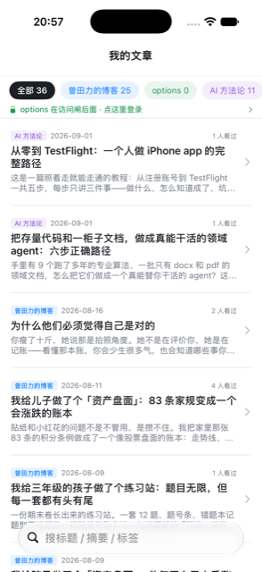

<p align="center"></p>

# 我的文章 · blog-reader

**三个博客站合成一条时间线，地铁没信号照样读。**

    

三个站早就在发 feed.json，app 只是又一个消费者。正文缓存放 Application Support 而不放 Caches——后者会在空间紧张时被系统清掉，恰好在最需要离线的时候把离线拿走。解析层有 462 个值的回归，反向验证抓过两个真 bug。

<table><tr>
<td align="center" width="25%"><br><sub>三站合成一条时间线；在闸后的站如实显示「0 篇 · 点这里登录」，不装没事</sub></td>
</tr></table>

## 它做什么

| 功能 | 说明 |
|---|---|
| **三个站，一条流** | 三个博客站的 feed 按日期合成一条时间线，站名做成筛选芯片。三站会撞同名 slug，id 里带站前缀——不带的话 SwiftUI 会静默少渲染，这个 bug 被 462 个值的解析回归抓过。 |
| **正文离线永存** | 取过的正文放 Application Support 而不是 Caches——后者会在空间紧张时被系统清掉，恰好在最需要离线的时候把离线拿走。网络失败不清已有内容，单站超时只影响那一站。 |
| **受闸的站如实说「进不去」** | 有一个站整站在访问闸后面。取不到时界面上写的是「在访问闸后面 · 点这里登录」，不是一句含糊的「解析失败」——错误必须指出方向，这是全舰队从这个 app 开始立下的规矩。 |

## 怎么拿到

TestFlight 内测中；文章本体在 blog.tianli.cyou 公开可读。

读的是三个博客站公开的 `feed.json`（blog.tianli.cyou 等），clone 下来就能跑；其中一个站在访问闸后，那一站会显示「点这里登录」。

## 构建

```bash
brew install xcodegen
xcodegen generate
xcodebuild -scheme BlogReader -destination 'generic/platform=iOS Simulator' build
```

- 仓里的 `*.sh` 是作者本机舰队脚本的 shim（三平台构建 / 真机装机 / TestFlight），依赖 `~/Dev` 下的总部工具，不在本仓；没有那套工具时它们会明确退出。
- `Shared/PlatformCompat.swift` 是总部共享文件的逐字节副本（iOS-only SwiftUI 修饰符在 macOS 侧的同名 no-op），别在这里改它。

开发细节（回归、验证通道、约束）见 [DEVELOPING.md](DEVELOPING.md)。

## 相关

- 产品页：<https://apps.tianli.cyou/p/blog-reader-ios.html>
- 舰队总览（10 个 app 怎么来的）：<https://apps.tianli.cyou/ios.html>
- 教程：[从零到 TestFlight：一个人做 iPhone app 的完整路径](https://blog-ai.tianli.cyou/nine-ios-apps-in-two-weeks)

## License

MIT © 2026 曾田力 (Tianli Zeng)
